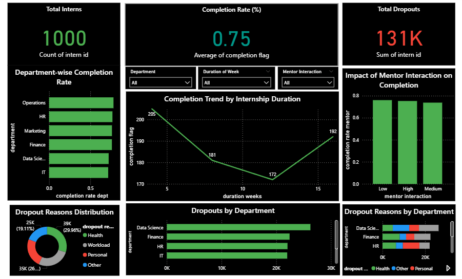
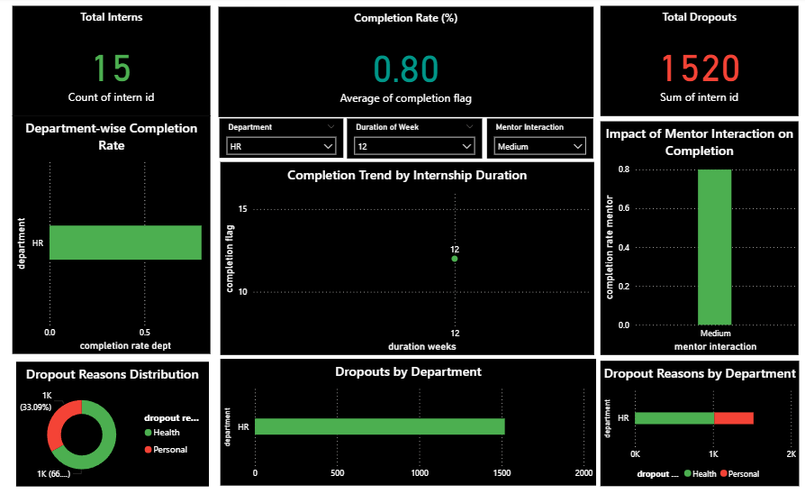
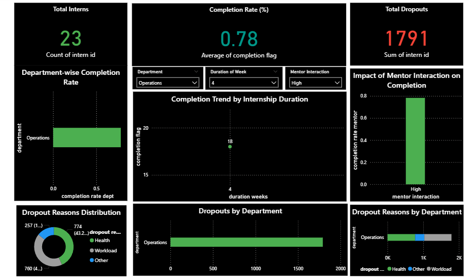
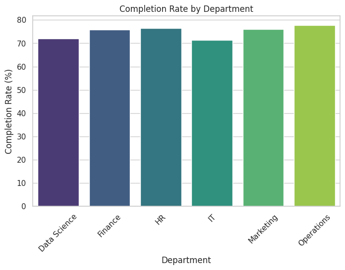
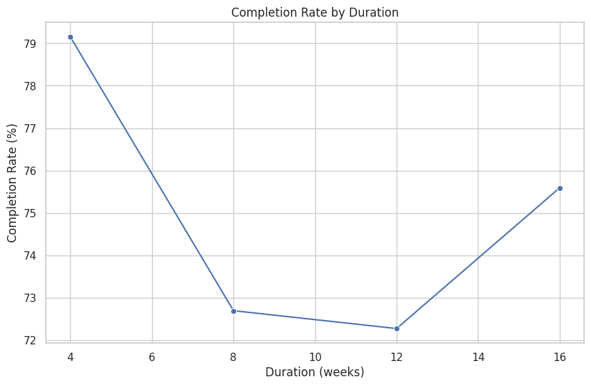
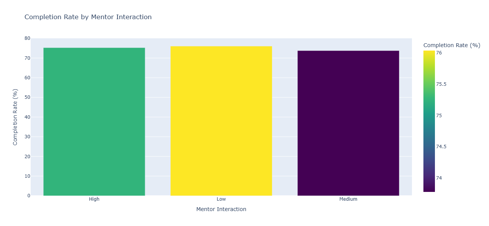

# Internship Dashboard Analysis 📊

## 🔹 Objective
Analyze and visualize internship completion rates to identify key success factors such as department, duration, and mentor interaction.

---

## 🔹 Tools Used
- **Python (Google Colab)** → Data cleaning & preprocessing
- **Power BI** → Interactive dashboard creation & visualization

---

## 🔹 Dataset
Synthetic dataset of 1000 interns with:
- Department
- Enrollment date
- Duration (weeks)
- Mentor interaction
- Completion status
- Dropout reason

---

## 🔹 Dashboard Screenshots

### Dashboard - Overall View


### Dashboard - Filtered View (By Department)


### Dashboard - Filtered View (By Mentor Interaction)


---

## 🔹 Charts from Python (Colab)

  
  


---

## 🔹 Deliverables
- 📑 Data Cleaning & Analysis → [Notebook](notebooks/internship_analysis.ipynb)
- 📊 Dashboard (Power BI) → `Internship_Analysis.pbix`
- 📷 Screenshots → in `reports/`
- 🗂️ Dataset → `data/internship_data_cleaned.csv`

---

## 🔹 How to Use
1. Clone the repo:
   ```bash
   git clone https://github.com/<your-username>/internship-dashboard-analysis.git

Open notebooks/internship_analysis.ipynb in Google Colab or Jupyter.

Open Internship_Analysis.pbix in Power BI Desktop.

Explore dashboards in reports/.

🔹 Author

👤 Your Name
📌 Data Analysis Intern | Learning Power BI & Python
🔗 LinkedIn Profile mahsaanullah